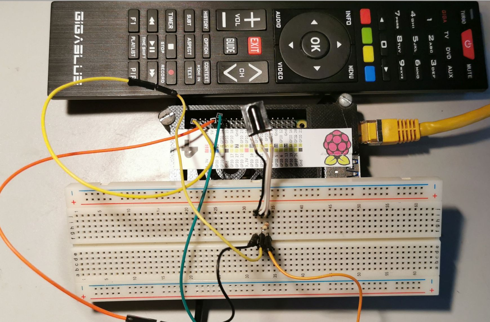

# Gigablue Fernbedienung für den Receiver Gigablue UHD UE 4K

Die Lirc-Konfiguration für die [Gigablue Fernbedienung](./gigablue.lircd.conf) 

Die Konfiguration wurde mit einem Raspberry Pi 4 aufgezeichnet unter der Verwendung folgender Schaltung.

        RPI         IR-Empfänger
        
                          ________________  
        Gnd -> -----------|   TSOP31236   |
        3,3v   --+--------|   XXXXXXXXX   |
                 | 10KΩ   |   XXXXXXXXX   |  
        GPIO18 --+--------|_______________|

        Der Wiederstand 10KΩ ist ein pullup 

## Einrichten von Lirc und RPI

1.  Installation und einrichten von Lirc

        sudo apt install lirc 
        
2. Rpi konfigurieren mit **sudo pico /boot/firmware/config.txt** und folgendes am Ende eintragen
    
        dtoverlay=gpio-ir,gpio_pin=18

3. Lirc konfigurieren **sudo pico /etc/lirc/lirc_options.conf** und folgendes eintragen

        device = /dev/lirc0
        driver = default

4. Lirc neu starten

        sudo systemctl restart lircd

5. Testen ob die Schaltung und konfiguration funktioniert 

        mode2 -d /dev/lirc0

    Es sollte folgende Ausgabe kommen       

        pi@RPI4:~/temp $ mode2 -d /dev/lirc0
        Using driver default on device /dev/lirc0
        Trying device: /dev/lirc0
        Using device: /dev/lirc0
        pulse 9128
        space 4416
        pulse 661
        space 488
        pulse 636
        space 488
        pulse 636
    
6. Aufzeichnen einer neuen Fernbedienung 

        #Lirc beenden
        sudo systemctl stop lircd.socket lircd.service

        #Aufzeichnung starten
        irrecord -d /dev/lirc0 ~/gigablue.conf
        
        #Aufgezeichnete Konfiguration lirc bekannt geben
        sudo cp  ~/gigablue.lircd.conf /etc/lirc/lircd.conf.d/

        #Lirc neu starten
        sudo systemctl start lircd

7. Testen der aufgezeichneten Fernbedinung

        irw        

      Funktioniert die aufgezeichnete Ferbedingung nicht kann es sein das **irrecord** ein Fehler bei der Aufzeichnung gemacht hat. In meinem fall musste ich in der Konfiguration die zweite Hex Zahl bei den Tasten löschen, danach funktionierte es prima. Hab keine Ahnung warum **irrecord** das macht aber es kann sein da die Gigablue Fernbedienung keine Repeat mask bei den IR Codes hat.

       Funktionierte nicht 
       KEY_POWER		0x0AF559A6 0xF0000000
       
       Funktionierte 
       KEY_POWER		0x0AF559A6 

© Matthias Zartmann 2024   