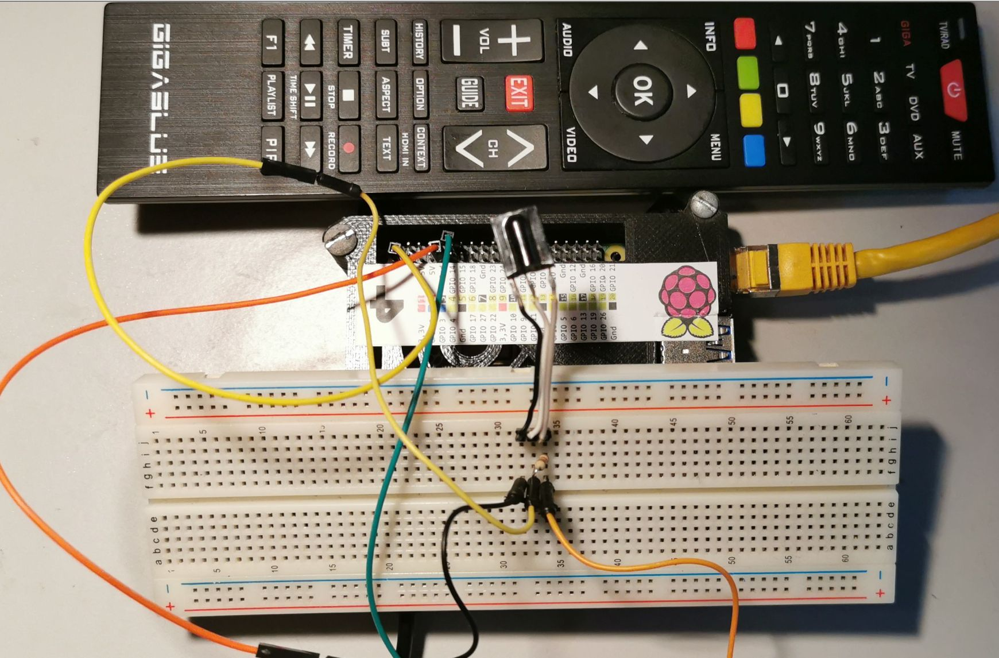

# Gigablue Remote Control for the Gigablue UHD UE 4K Receiver

The LIRC configuration for the [Gigablue Remote Control](./gigablue.lircd.conf) 

The configuration was recorded using a Raspberry Pi 4 with the following circuit:

        RPI         IR Receiver
        
                          ________________  
        Gnd -> -----------|   TSOP31236   |
        3.3V   --+--------|   XXXXXXXXX   |
                 | 10KΩ   |   XXXXXXXXX   |  
        GPIO18 --+--------|_______________|

        The 10KΩ resistor is a pull-up.

## Setting up LIRC and the RPI

1. Install and set up LIRC:

        sudo apt install lirc 
        
2. Configure the RPI with **sudo pico /boot/firmware/config.txt** and add the following at the end
    
        dtoverlay=gpio-ir,gpio_pin=18

3. Configure LIRC with **sudo pico /etc/lirc/lirc_options.conf** and add the following

        device = /dev/lirc0
        driver = default

4. Restart LIRC

        sudo systemctl restart lircd

5. Test if the circuit and configuration work

        mode2 -d /dev/lirc0

    The following output should appear:

        pi@RPI4:~/temp $ mode2 -d /dev/lirc0
        Using driver default on device /dev/lirc0
        Trying device: /dev/lirc0
        Using device: /dev/lirc0
        pulse 9128
        space 4416
        pulse 661
        space 488
        pulse 636
        space 488
        pulse 636
    
6. Record a new remote control

        # Stop LIRC
        sudo systemctl stop lircd.socket lircd.service

        # Start recording
        irrecord -d /dev/lirc0 ~/gigablue.conf
        
        # Register the recorded configuration with LIRC
        sudo cp ~/gigablue.lircd.conf /etc/lirc/lircd.conf.d/

        # Restart LIRC
        sudo systemctl start lircd

7. Test the recorded remote control

        irw        

      If the recorded remote control does not work, it might be due to an error made by **irrecord** during the recording. In my case, I had to delete the second hex number for the buttons in the configuration, after which it worked perfectly. I have no idea why **irrecord** does this, but it could be because the Gigablue remote control does not have a repeat mask for the IR codes.

       Did not work:
       KEY_POWER		0x0AF559A6 0xF0000000
       
       Worked:
       KEY_POWER		0x0AF559A6  

 © Matthias Zartmann 2024